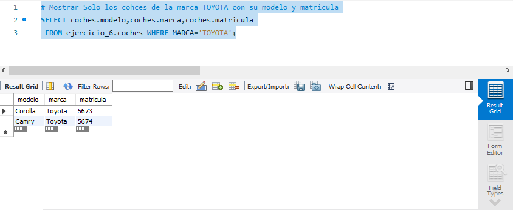

# concesionario-GRUPO-6
<p>

### ¡Ejercicio 6!

A partir del siguiente enunciado realizar una base de datos


"A un concesionario de coches llegan clientes para comprar automóviles. De cada coche interesa saber la matrícula, modelo, marca y color. Un cliente puede comprar varios coches en el concesionario. 

Cuando un cliente compra un coche, se le hace una ficha en el concesionario con la siguiente información: dni, nombre, apellidos, dirección y teléfono.

Los coches que el concesionario vende pueden ser nuevos o usados (de segunda mano). De los coches nuevos interesa saber el número de unidades que hay en el concesionario. De los coches viejos interesa el número de kilómetros que lleva recorridos.

El concesionario también dispone de un taller en el que los mecánicos reparan los coches que llevan los clientes. Un mecánico repara varios coches a lo largo del día, y un coche puede ser reparado por varios mecánicos. 
Los mecánicos tienen un dni, nombre, apellidos, fecha de contratación y salario. Se desea guardar también la fecha en la que se repara cada vehículo y el número de horas que se tardado en arreglar cada automóvil".


<div>
  
</div>

</p>
<br>
---
<details><summary>Consulta 1</summary>
<p>
# Mostrar Solo los cohces de la marca TOYOTA con su modelo y matricula
  ```SQL
SELECT coches.modelo,coches.marca,coches.matricula
 FROM ejercicio_6.coches WHERE MARCA='TOYOTA';
```
<div>
  
</div>
  
</p>
</details>
<details><summary>Consulta 2</summary>
<p>
# # Selecciona el nombre del cliente y la matrícula del coche que ha sido reparado por un mecánico con un salario superior a 1000
  ```SQL
SELECT clientes.nombre, coches.matricula
FROM clientes, coches, reparaciones, mecanicos
WHERE clientes.dni = coches.clientes_dni
AND coches.matricula = reparaciones.coches_matricula
AND reparaciones.mecanicos_dni = mecanicos.dni
AND mecanicos.salario > 1000;
```
<div>
  
</div>
  
</p>
</details>
Ejercicio 6 base de datos ejercicio concesionario de coches llegan clientes para comprar automóviles.
